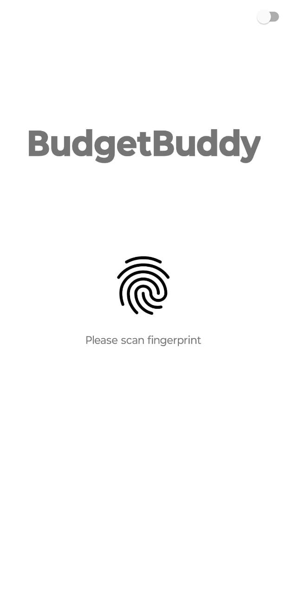
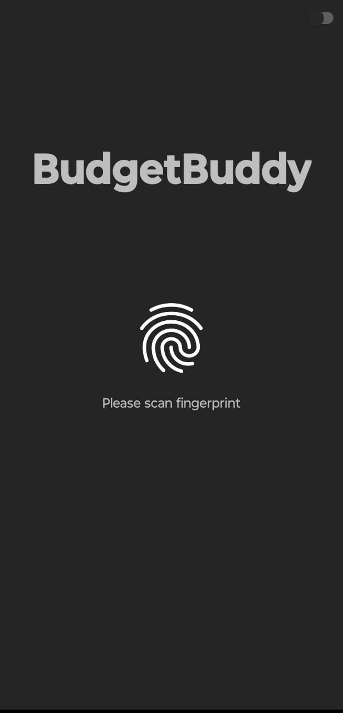

# **BudgetBuddy - Aplicación de Control de Gastos**

## Descripción

BudgetBuddy es una aplicación móvil diseñada para ayudarte a llevar un registro de tus gastos
diarios
y mantener tu presupuesto bajo control.
Con BudgetBuddy, podrás realizar un seguimiento detallado de tus gastos,
establecer notificaciones para futuros pagos y visualizar tus hábitos de gastos con gráficos
estadísticos.

* Inicio de sesión con biometría: Accede de forma segura a la aplicación mediante autenticación
  biométrica (huella digital).
* Registro de gastos diarios: Registra tus gastos diarios de manera rápida y sencilla.
* Notificaciones de pagos futuros: Guarda tus futuros gastos y establece notificaciones para
  recordarte cuando se acerque el día de pagar.
* Estadísticas y gráficos: Visualiza tus gastos con gráficos de estadísticas para un mejor análisis
  y comprensión de tus hábitos de gastos.
* Modo oscuro y claro: Disfruta de la aplicación en el modo oscuro o claro, según tus preferencias.

## Capturas de pantalla

<table>
  <tr>
    <td align="center">
    </td>
    <td align="center">
    </td>
  </tr>

  <tr>
    <td align="center">
      
    </td>
    <td align="center">
      
    </td>
  </tr>

  <tr>
    <td align="center">
      
    </td>
    <td align="center">
      
    </td>
  </tr>

  <tr>
    <td align="center">
      
    </td>
    <td align="center">
      
    </td>
  </tr>
</table>

## Tecnologías

BudgetBuddy ha sido desarrollado utilizando las siguientes tecnologías y herramientas:

* Kotlin: Lenguaje de programación principal para el desarrollo de la aplicación Android.
* Android Studio: Entorno de desarrollo integrado (IDE) para la creación y edición del código de la
  aplicación.
* Room: Biblioteca de persistencia utilizada para el manejo de la base de datos local y el ORM (
  Object-Relational Mapping) para el acceso a los datos.
* Shared Preference: Mecanismo de almacenamiento utilizado para guardar y recuperar configuraciones
  y preferencias de la aplicación.
* MPAndroidChart: Biblioteca de gráficos utilizada para mostrar las estadísticas y gráficos de los
  gastos mensuales.
* Material Design: Biblioteca de componentes y estilos de diseño utilizada para crear una interfaz
  de usuario moderna.
* Biometric: Biblioteca para la autenticación biométrica que permite el inicio de sesión con huella
  digital para una experiencia de usuario segura y conveniente.

## Instalación

Para instalar BudgetBuddy en tu dispositivo Android, sigue estos pasos:

<ol>
<li>
Descarga el archivo APK desde enlace_apk.
</li>
<li>
Habilita la opción "Fuentes desconocidas" en la configuración de seguridad de tu dispositivo Android.
</li>
<li>
Instala el APK descargado en tu dispositivo.
</li>

</ol>

¡Listo! Ahora puedes abrir BudgetBuddy y comenzar a llevar un registro de tus gastos.
